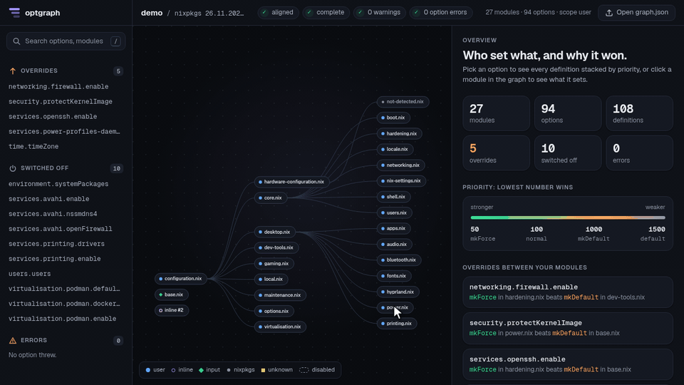

# optgraph

Shows how a NixOS flake configuration is put together: the module import graph, and for every option who sets it, at what priority, and why one definition won over the others.



`optgraph` evaluates a `nixosConfigurations.<host>` of your flake and writes `graph.json`: the modules and where they come from (your files, inline modules, flake inputs, nixpkgs), and all definitions of each option you touch, including the ones that lost and the ones switched off by `mkIf`. With `--html` it also writes a single-file interactive viewer of the same data.

Live demo: https://ilqqy.github.io/optgraph/ ([Watch the tour](https://ilqqy.github.io/optgraph/?tour): the animation above, played by the viewer itself)

It shows the graph of [`demo/`](demo/), a synthetic Hyprland desktop configuration (no real machine, the only user is `demo`). Options worth opening:

- `mkForce` beats `mkDefault`: [`networking.firewall.enable`](https://ilqqy.github.io/optgraph/?opt=networking.firewall.enable), turned off with `mkDefault` in `dev-tools.nix` and forced on in `core/hardening.nix`.
- `mkIf false`: [`services.printing.enable`](https://ilqqy.github.io/optgraph/?opt=services.printing.enable), set in `desktop/printing.nix` behind the `demo.features.printing` flag, which is off, so the option default wins.
- Several winners: [`environment.systemPackages`](https://ilqqy.github.io/optgraph/?opt=environment.systemPackages), a list set in six modules (plus one inactive definition), with the nixpkgs definitions counted as `+961 nixpkgs`.

Status: phase 2 of 4 (extractor and viewer). Diff and polish are not started.

## Install and run

Requires Nix with flakes enabled. Developed and tested with Nix 2.34.8 on x86_64-linux; the package is also exposed for aarch64-linux, which was not run.

From a checkout, on the demo configuration (first run downloads the demo's nixpkgs):

```sh
nix run . -- ./demo#nixosConfigurations.demo -o graph.json
```

From GitHub: <!-- unverified: the repository is not published yet -->

```sh
nix run github:ilqqy/optgraph -- <flakeref>#nixosConfigurations.<host> -o graph.json
```

Or build once and call the binary:

```sh
nix build . && ./result/bin/optgraph --help
```

The argument is `<flakeref>#nixosConfigurations.<host>`. The attribute must be a configuration (a `nixosSystem` result). The CLI never passes `--impure` and forces `--option pure-eval true`, so evaluation stays pure whatever your Nix config says. The target flake's `flake.lock` is never written (`--no-write-lock-file`).

Logs go to stderr. Without `-o` the JSON goes to stdout. With `-o` it is written to a temporary file next to the target and renamed, so a failed run leaves no partial file (except the deliberate partial document of exit code 3, below). A write error exits 2.

### Flags

| Flag | Meaning |
|---|---|
| `-o`, `--output FILE` | Write `graph.json` to `FILE`. Default: stdout (unless `--html` is given). |
| `--html FILE` | Write a self-contained viewer page with the graph embedded. Can be combined with `-o`. |
| `--all` | No scope filter: every declared option and every loaded module. Slow and big, see [Measured](#measured). |
| `--include-all-definitions` | List every definition. By default, nixpkgs definitions that neither win nor come from a non-nixpkgs module are only counted (`options[].omitted`); the option default is always listed. Independent of `--all`. |
| `--max-retries N` | Number of uncatchable crashes to recover from by re-running. Default 10, with `--all` 100. The (N+1)th crash ends the run with partial output and exit 3. The fixture crashes 3 times on purpose: `--max-retries 3` completes, `--max-retries 2` ends partial. |
| `--time-budget SECS` | Wall-clock budget for all evaluations. Default 600, with `--all` 1800. Each evaluation runs under `timeout` with what is left of the budget; an evaluation that is killed (status 124), or a budget that runs out between evaluations, ends the run as exhausted (exit 3). The partial-output evaluations that follow have their own limit of `max(120, SECS/4)` seconds each, so the total can exceed `SECS`. |
| `-h`, `--help` | Usage. |

### Exit codes

| Code | Meaning |
|---|---|
| 0 | Done. |
| 1 | Usage error. |
| 2 | Flake or evaluation error. No output is written. The flake or attribute cannot be resolved; the value is not a NixOS configuration (`not-a-configuration`); nixpkgs is older than 25.11 or has no `.graph` (`nixpkgs-unsupported`); the configuration does not evaluate (`config-broken`); a crash could not be localized; or the output cannot be written. Coded errors print as `optgraph: error: <code>: <message>`. |
| 3 | Crash recoveries or time budget exhausted. A partial document with `meta.complete = false` and a `budget-exhausted` warning is still written: up to two more evaluations, first with previews and the self-check off for all options, then with no options (modules only). |

## What you get

`graph.json` has three parts: `meta`, `modules`, `options`. The full field reference is in [docs/schema.md](docs/schema.md); the JSON Schema is `schema/graph.schema.json`.

- `modules`: every module in the scope with its imports and an origin: `user`, `user-inline` (an anonymous module whose code is yours; the ones that are entries of your `nixosSystem { modules = [ ... ]; }` list also get `modulesIndex`), `input:<name>`, `nixpkgs` or `unknown`. Anonymous modules are attributed by the file they live in, or, when their `_file` is only a fallback, by the position of their code. `position` is the `file:line` of a module's first attribute. Modules disabled through `disabledModules` are listed as disabled.
- `options`: for each option that one of your modules defines, every definition from every module: priority (1500 default, 1000 `mkDefault`, 100 plain, 50 `mkForce`, 10 `mkVMOverride`), whether it is active (`mkIf` conditions), a bounded value preview (never the raw value), which definitions won, and the resulting `highestPrio`. The option's own default is always listed as the last definition, also when it lost. When a value or condition throws, the winner is unknown: `highestPrio` is `null`, `winners` is empty and `error` says so.
- `meta.warnings`: everything that went wrong or was degraded, with a machine-readable code.

On the demo (the commands were run on the output of the call above):

```sh
jq -r '.options[] | select(.path == "networking.firewall.enable") | .definitions[] | [.priority, (.module // "(option default)" | sub("^.*/demo/"; "")), .valuePreview] | @tsv' graph.json
```

```
1000	modules/dev-tools.nix	false
50	modules/core/hardening.nix	true
1500	(option default)	true
```

`mkForce` (50) wins over `mkDefault` (1000) and over the option default (1500). A definition under a false `mkIf` is listed with unknown priority, and here the option default wins:

```sh
jq -r '.options[] | select(.path == "services.printing.enable") | .definitions[] | [(.priority // "?"), .active, (.condition // "-"), (.valuePreview // "-")] | @tsv' graph.json
```

```
?	false	mkIf-false	-
1500	true	-	false
```

A list set in several modules has several winners; only the non-nixpkgs definitions are listed:

```sh
jq -c '.options[] | select(.path == "environment.systemPackages") | {listed: (.definitions | length), winners: (.winners | length), omitted}' graph.json
```

```
{"listed":8,"winners":6,"omitted":{"nixpkgsActive":69,"nixpkgsInactive":892}}
```

Six definitions win, the seventh is under a false `mkIf`, the eighth is the option default (`[ ]`), which lost.

Where the modules come from (`input:shared` is the demo's second local input, `user-inline` the module written inline in `demo/flake.nix`, `nixpkgs` the `not-detected.nix` profile that `hardware-configuration.nix` imports):

```sh
jq -r '.modules[].origin' graph.json | sort | uniq -c
```

```
      1 input:shared
      1 nixpkgs
     24 user
      1 user-inline
```

The demo has no warnings (`jq '.meta.warnings | length' graph.json` prints `0`). Crashes, throwing options and the warnings they cause are exercised by `tests/fixture`, which breaks options on purpose.

## Viewer

`optgraph … --html graph.html` writes one HTML file that opens offline in any browser. The same viewer without embedded data is `nix build .#viewer` (`result/index.html`); open a `graph.json` in it with *Open graph.json* or by dropping the file onto the page, or serve it next to a graph and open `index.html?src=graph.json`. Served over http(s) with no embedded data and no `?src=`, the page loads `./demo.json` if the site has one (that is how the live demo works); opened as a `file://` page it shows the drop zone.

Layout: a slim sidebar on the left (the search box and three lists with counts), the import graph in the middle, a wide inspector on the right, and a top bar with the host, the nixpkgs version and status chips (attribution, `complete`, warnings, option errors; the last two open their list).

- Start (nothing selected): the sidebar lists *Overrides* (options where a listed definition lost to a stronger one, conflicts between non-nixpkgs modules first; the option default losing does not count, and neither do omitted nixpkgs definitions, since `omitted` does not say whether they won), *Switched off* (definitions from non-nixpkgs modules under a false `mkIf`) and *Errors* (options whose `error` is set). The inspector shows the counts of modules, options, definitions, overrides, switched-off definitions and errors, the priority scale (50 mkForce, 100 normal, 1000 mkDefault, 1500 default; lower wins) and the first overrides, e.g. `mkForce` in hardening.nix beats `mkDefault` in dev-tools.nix.
- Option detail: the path, its type and a verdict ("hardening.nix wins with mkForce 50, over 2 weaker definitions"), then the priority ladder: one card per listed definition, sorted by priority (lowest first, unknown last) on a rail of priority badges with their names. Each card has the module (click it to open the module), its origin, a status (*Winner*, *Lost*, *Switched off*, *Unknown*: a mark, a word and a border style, never colour alone), the value preview with a copy button, and a one-line reason computed from the data: `beats dev-tools.nix: 50 < 1000`, `beaten by hardening.nix: 50 < 1000`, `switched off: its mkIf condition is false`, `merged with 5 others at priority 100`. Options with several winners (lists, attribute sets) get a *Merged from N modules* header; the option default is a dashed card. `+N nixpkgs` counts definitions that were omitted. *Copy link* copies a deep link to the option. Cards come in with a short staggered animation, none with `prefers-reduced-motion`.
- Module detail: its file, id, position and origin, how many options it sets, imports and importers, and the options it sets with its status and priority for each.
- Graph: a layered left-to-right layout of the import graph computed in the page (longest-path layers from the roots, dummy nodes for long edges, barycenter sweeps against crossings; `viewer/src/layout.js`). Modules are pills with a short label and an origin mark that differs in shape and colour (user disc, user-inline ring, `input:*` diamond, `unknown` square, nixpkgs small grey disc); edges are curves, disabled modules dashed. Selecting an option rings its defining modules (winner: solid green ring with a glow and a `✓ 50 mkForce` chip; lost: amber ring and chip; `mkIf` false: dashed ring and chip), dims the rest, keeps the import paths to them lit and eases the camera to fit them. Hovering a module shows its full path, origin and how many options it sets; clicking it opens the module. Drag to pan; zoom with the wheel, a pinch or the buttons. Above 300 modules (`--all`) only the non-nixpkgs modules are drawn, with a banner.
- Command palette: `/` or Ctrl+K (⌘K) opens it, and so does the sidebar's search box. Fuzzy search over option paths and modules (short label or path), matched characters highlighted; if some path contains the query, only those are listed. Results come in groups: Overrides, Switched off, Errors, Options, Modules. Arrows move, Enter opens, Esc closes.
- Keys: `/` and Ctrl+K the palette; `Esc` closes the palette or the warnings panel, else clears the selection (back to the start summary).
- Themes: light and dark follow the system setting. Text keeps at least 4.5:1 contrast on its background in both.
- Mobile (up to 760 px wide): the graph fills the screen and a bottom tab bar replaces the sidebar (Graph, Search, Overrides, Off, Errors; the lists open as a bottom sheet). The inspector is a bottom sheet: it peeks with its title, opens to 60 % when you pick an option or module, and its handle toggles or drags it to full height.
- Deep links, for embedded data and `?src=` alike: `?opt=<option path>` opens that option's ladder and highlights its modules, `?module=<index or id>` opens a module (index into `modules`, or its `id`), `?warnings` opens the warnings panel. The address bar follows the selection (`history.replaceState`), so it is always a link to what you see. Example: `graph.html?opt=networking.hostName`, `https://ilqqy.github.io/optgraph/?module=0`.
- Tour: `?tour` plays a 19-second scripted walk through the viewer (the GIF at the top), driving the real palette, lists, ladder and graph with a drawn cursor, key caps and captions; Pause/Play/Restart and *Exit tour* sit at the bottom right of the graph, and any real click or key hands the page back. With `prefers-reduced-motion` it waits for *Play* and jumps instead of moving. It shows the demo's `networking.firewall.enable`, `services.printing.enable`, `i18n.defaultLocale` and `environment.systemPackages`; on another graph it takes the first options that fit each scene, and does not start if one is missing. Captions take module names and priorities from the graph. `?tour&t=<ms>` renders the single frame at that time, which is how the GIF is made.
- Local only: no analytics and no external requests. The page's Content-Security-Policy allows inline code only and limits `fetch` (`?src=`) to the page's own origin. The fonts are Geist and Geist Mono (SIL Open Font License 1.1, licence in `viewer/vendor/fonts/OFL.txt`), Latin subsets made by `tools/subset-fonts.sh` from nixpkgs' `geist-font` 1.7.0, pinned by `viewer/vendor/fonts/SHA256SUMS` (checked by `viewer/build.sh`) and inlined as base64. The page builds them with the `FontFace` API from those bytes, so nothing is fetched and the CSP needs no `font-src`. The whole page is about 200 KB; the viewer check keeps it under 250 KB.

## Scope and support

- Default scope: options with at least one definition from a module that is not nixpkgs, plus the non-nixpkgs modules, their ancestors and their direct imports. `--all` lifts the filter.
- nixpkgs 25.11 to 26.11 is supported. The fixture check passes with nixpkgs `c59305b` (26.11) and with nixos-25.11 (`b6018f87da91d19d0ab4cf979885689b469cdd41`). <!-- unverified by the docs writer: the 25.11 run was reported by the verifier, 2026-10-03 --> Older releases are refused (exit 2, `nixpkgs-unsupported`; run with nixos-25.05). A newer release works with a `nixpkgs-untested` warning.
- Configurations built with `nixpkgs.lib.nixosSystem` are supported. When a configuration is not built that way (tested: `nixos/lib/eval-config.nix` called directly) optgraph falls back to file-based attribution and adds an `alignment-failed` warning; `modulesIndex` is always `null`, and the wrapper nodes around inline modules show up as modules of their own. Other builders were not tried.
- Flake inputs are resolved with `nix flake archive --dry-run` and `nix flake metadata`, so evaluating a flake needs its inputs to be fetchable. Nested inputs are named `parent/child`. A relative `path:` input of the root flake is resolved as `<source root>/<dir>/<path>`.

## How crashes are handled

`builtins.tryEval` catches only `throw` and failed `assert`. Other errors (`abort`, missing attributes, ...) kill the whole `nix eval`, and nixpkgs has options that do this. optgraph handles them at the process level:

- Each unit of work (loading a module, walking its `config`, reconstructing an option, the self-check, the preview) runs inside an error-context marker. After a crash the CLI reads the innermost marker (the last one in the `--show-trace` output) and re-runs with that unit degraded: previews or self-check switched off for the option, or the option or module excluded. A crash while loading a module or while walking its `config` excludes the module. Each recovery shows up as a warning (`preview-crash`, `selfcheck-crash`, `eval-crash`) that carries the Nix error text.
- Without a marker the CLI bisects the in-scope options. `OPTGRAPH_LOCALIZE=bisect` forces this, for testing. It is coarser: the culprit option is excluded entirely.
- When the recovery limit or the time budget runs out, the CLI writes partial output (exit 3, see above).
- A built-in self-check compares the reconstructed winners (`highestPrio`, files) with what the module system reports. A difference becomes a `reconstruction-mismatch` warning; where the module system's own accessors throw or the winner is unknown, the check is skipped with a `selfcheck-skipped` warning. There were no mismatches on the fixture, with or without `--all`.

## Measured

Nix 2.34.8, nixpkgs `c59305b`, x86_64-linux, `/usr/bin/env time -v`; fixture `./tests/fixture#nixosConfigurations.test`, demo `./demo#nixosConfigurations.demo`:

| Run | Wall | Max RSS | JSON | Modules | Options | Evaluations / crash recoveries | Mismatches |
|---|---|---|---|---|---|---|---|
| fixture, default (2026-10-09) | 4.84 s | 302 MB | 41 KB | 24 | 31 | 4 / 3 (all deliberate) | 0 |
| fixture, `--all` (2026-10-03, before definitions were omitted by default) | 84 s | 1.43 GB | 20 MB | 3993 | 16812 | 14 / 13 (3 deliberate, 10 in stock nixpkgs options; by stage: 9 self-check, 3 preview, 1 reconstruct) | 0 |
| demo, default (2026-10-09) | 1.41 s | 305 MB | 119 KB | 27 | 94 | 1 / 0 | 0 |

With `OPTGRAPH_LOCALIZE=bisect` the default run takes 17 evaluations and 2 crash recoveries. Timings vary by about a second between runs.

## Limitations

- Submodule-typed options (`users.users`, `systemd.services`) and freeform options (`services.openssh.settings`) are leaves: definitions are listed per module at the option's own path, with no attribution to the entries inside.
- The priority of a definition under a false `mkIf` is unknown (`null`): the module system never forces it, and neither does optgraph.
- An option whose active definition has an unknown priority, or whose `mkIf` condition throws, gets no winner (`highestPrio: null`, `winners: []`).
- Messages of `throw`/`assert` cannot be read (`tryEval` does not return them); `error` fields name the failing stage only. Crash warnings do carry the Nix error text.
- `--all` is slow and big (table above).
- For options with several winners (lists, attrsets) only non-nixpkgs definitions (and the option default) are listed; nixpkgs winners are counted in `omitted`, so the listed `winners` of such an option are not the whole merged value. Use `--include-all-definitions` to see them.
- `graph.json` and `--html` pages contain previews of option values. Previews are bounded but not scrubbed: only options whose path looks like a secret (`password`, `token`, `secret`, `credential`, `api_key`, ...) are `<redacted>`. A preview can still contain sensitive values; don't share `graph.json` or an `--html` page blindly.
- Relative `path:` inputs are resolved only for the root flake.
- Inline user modules carry nixpkgs' own `flake.nix` as `file` (a nixosSystem quirk); use `origin`, `modulesIndex` and `position` for them. An anonymous module nested in an inline one has no `modulesIndex`.
- A module key built from a string keeps what the string says: with a relative `path:` input, `"${extra}/interpolated.nix"` gives an id containing `/./`.
- The internal `_module.args` definitions are not visible, and `_module.*` options are never listed.
- No fixture case exercises a crash while loading or walking a module; that path is not covered by a test.
- Only NixOS configurations are supported; other module-system roots are untested.

## Development

```sh
nix develop            # shell with gh, jq, nixfmt, check-jsonschema, ffmpeg, python3
nix flake check -L     # lib checks on the fixture and the demo, schema validation, CLI build (a few minutes)
nix fmt                # nixfmt (RFC style); CI runs: nix fmt -- --check .
nix develop -c tests/e2e.sh [OUTDIR]   # CLI end to end: crash recovery, bisection, budget, exit codes, --html
nix build .#viewer     # viewer/build.sh: one result/index.html
nix run . -- ./demo#nixosConfigurations.demo -o demo.json   # the live demo's graph, as pages.yml builds it
```

`nix flake check -L`, `nix fmt -- --check .` and `tests/e2e.sh` pass on this checkout (2026-10-09). `tests/assertions.jq` has 88 checks on the fixture's output. `nix flake check` skips aarch64-linux unless `--all-systems` is given. The e2e test needs network access for the fixture's nixpkgs.

Layout: `nix/` extraction library, `cli/` the `nix eval` wrapper, `viewer/` the viewer sources (`template.html`, `style.css`, `src/*.js`, `vendor/fonts/`), `tools/` the tour renderer and the font subsetter, `demo/` the demo flake (a synthetic desktop configuration; `pages.yml` extracts its graph at deploy time as the live demo's `demo.json`, and `checks.demo` keeps it free of warnings and option errors), `schema/graph.schema.json` output schema, `tests/fixture/` test flake, `docs/schema.md` field reference, `docs/module-system-notes.md` verified findings about `lib/modules.nix` with source references.

### Regenerating the tour

`docs/demo.gif` (README) and `docs/demo.webm` (1280x720, for the site) are rendered from the viewer's own tour, not recorded, so after a UI change one command rebuilds them:

```sh
tools/render-tour.sh [WORKDIR]   # default WORKDIR: /tmp/optgraph-tour
```

It builds the viewer and the demo's graph, serves both on `127.0.0.1`, and has headless Chromium (one long-lived instance, DevTools protocol over a pipe; `tools/tour-capture.py`, Python standard library only, run with the dev shell's `python3`) open `?tour&t=<ms>` for each of the 291 frames at 15 fps, dark theme, 1280x720. Any console error or uncaught exception fails the run. Then the dev shell's ffmpeg encodes the GIF (one palette, 960 px wide, lanczos; it steps down in frame rate and width while the GIF is 3 MB or more) and the WebM (VP9). Frames stay in `WORKDIR/frames`. Chromium is not in the dev shell: it needs a system `chromium` on `PATH` (or `CHROMIUM=<browser>`). On this checkout (2026-10-09): 80 s, GIF 2.7 MB (960 px at 12 fps; 15 fps came to 3.03 MB), WebM 729 KB; a second run gave byte-identical frames, GIF and WebM. The timeline itself is `viewer/src/tour.js`.

The fonts are regenerated the same way, from nixpkgs, with `tools/subset-fonts.sh` (fonttools; the output is reproducible and pinned in `viewer/vendor/fonts/SHA256SUMS`).

## License

MIT, see [LICENSE](LICENSE).
